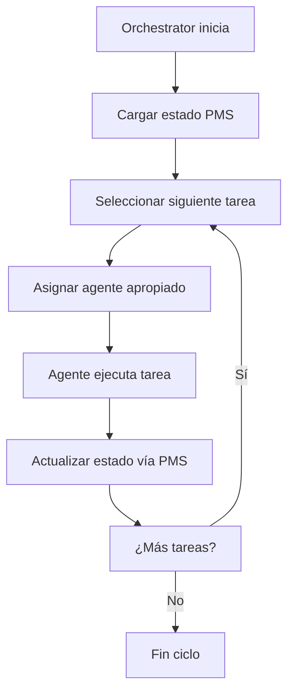
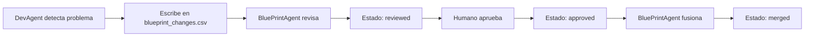

# Agents - Flow y Orquestación

## Arquitectura de Agentes

Este documento define el **flow de agentes** y su **orquestación**, manteniendo separada la responsabilidad de PMS-Core (persistencia) de la lógica de flow (coordinación).

### Separación de Responsabilidades

```
┌──────────────────────────────┐
│  1. Orchestration Layer      │  ← CrewAI, LangGraph, custom
│     - Define flow y orden    │
│     - Maneja dependencias    │
└─────────────▲────────────────┘
              │ Comandos/Eventos
┌─────────────┴────────────────┐
│  2. Agent Services           │  ← BluePrintAgent, DevAgent...
│     - Lógica de dominio      │
│     - Usa PMS-Core API       │
└─────────────▲────────────────┘
              │ pms_core.load/save()
┌─────────────┴────────────────┐
│  3. PMS-Core Library         │  ← Definido en ../pms/pms.md
└──────────────────────────────┘
```

## Agents Services Definidos

### BluePrintAgent
**Responsabilidad**: Gestión exclusiva del blueprint estratégico

```yaml
agent_id: blueprint_agent
role: Strategic Blueprint Manager
scope: ["blueprint", "blueprint_changes"] 
capabilities:
  - Único agente autorizado para modificar docs/blueprint.md
  - Procesa propuestas en blueprint_changes.csv
  - Gestiona versionado SHA-1 y changelog
  - Valida formato de fases → épicas → user stories

integration:
  load_scopes: ["blueprint", "blueprint_changes", "project_charter", "roadmap"]
  save_scopes: ["blueprint", "project_status"]
  mode: "update_dual"  # Cambios críticos requieren rollback atómico
```

### DevAgent  
**Responsabilidad**: Ejecución de tareas de desarrollo

```yaml
agent_id: dev_agent
role: Development Task Executor
scope: ["backlog_f*", "project_status"]
capabilities:
  - Lee tareas del backlog activo
  - Ejecuta tareas de código, tests, builds
  - Actualiza estado de tareas (P → C/F)
  - Propone cambios al blueprint si encuentra impedimentos técnicos

integration:
  load_scopes: ["backlog_f1", "blueprint", "project_status"]
  save_scopes: ["backlog_f1", "project_status", "blueprint_changes"]
  mode: "update_single"  # Actualizaciones de estado no críticas
```

### QAAgent
**Responsabilidad**: Validación y testing

```yaml
agent_id: qa_agent  
role: Quality Assurance
scope: ["backlog_f*", "project_status"]
capabilities:
  - Valida criterios de aceptación
  - Ejecuta tests automáticos
  - Propone mejoras de calidad al blueprint
  - Actualiza métricas de calidad

integration:
  load_scopes: ["backlog_f1", "blueprint"]
  save_scopes: ["backlog_f1", "project_status", "blueprint_changes"]
  mode: "update_single"
```

## Flow de Trabajo

### 1. Ciclo Principal



### 2. Gestión de Propuestas



## Contratos de Integración

### Regla Fundamental
**Los agentes NUNCA acceden a archivos directamente.** Siempre usan la API PMS-Core.

### Ejemplo de Implementación

```python
class DevAgent:
    def __init__(self, pms_core):
        self.pms = pms_core
    
    def execute_task(self, task_id):
        # 1. Cargar contexto
        backlog = self.pms.load(scope="backlog_f1")
        blueprint = self.pms.load(scope="blueprint") 
        
        # 2. Encontrar tarea
        task = find_task(backlog, task_id)
        
        # 3. Ejecutar trabajo
        result = self.do_development_work(task)
        
        # 4. Actualizar estado
        task.status = "C" if result.success else "F"
        self.pms.save(scope="backlog_f1", payload=backlog, mode="update_single")
        
        # 5. Actualizar métricas
        self.pms.save(scope="project_status", payload=new_metrics, mode="update_single")
        
        # 6. Si hay problemas, proponer cambio
        if result.needs_blueprint_change:
            change = {
                "id": generate_id(),
                "author": "DevAgent", 
                "timestamp": now(),
                "description": result.change_description,
                "status": "proposed"
            }
            self.pms.append(scope="blueprint_changes", payload=change)
```

## Configuración de Orchestrator

### Ejemplo con CrewAI

```yaml
# crew_config.yaml
crew:
  agents:
    - blueprint_agent
    - dev_agent  
    - qa_agent
  
  flow:
    - stage: "planning"
      agent: blueprint_agent
      trigger: "on_start"
      
    - stage: "development"
      agent: dev_agent
      trigger: "after_planning"
      depends_on: ["blueprint_ready"]
      
    - stage: "testing"
      agent: qa_agent
      trigger: "after_development"
      depends_on: ["dev_complete"]

  pms_integration:
    load_on_start: ["blueprint", "project_status"]
    save_on_complete: ["project_status"]
    health_check_interval: "5_minutes"
```

### Ejemplo con LangGraph

```python
from langgraph import StateGraph

def create_agent_flow():
    workflow = StateGraph()
    
    # Nodos
    workflow.add_node("load_state", lambda: pms_core.load("project_status"))
    workflow.add_node("blueprint_work", blueprint_agent.execute)
    workflow.add_node("dev_work", dev_agent.execute) 
    workflow.add_node("qa_work", qa_agent.execute)
    workflow.add_node("save_state", lambda state: pms_core.save("project_status", state))
    
    # Flujo
    workflow.add_edge("load_state", "blueprint_work")
    workflow.add_edge("blueprint_work", "dev_work")
    workflow.add_edge("dev_work", "qa_work") 
    workflow.add_edge("qa_work", "save_state")
    
    return workflow.compile()
```

## Eventos y Comunicación

### Eventos del Sistema

- `task_started`: Agente inicia una tarea
- `task_completed`: Tarea terminada (C/F)
- `blueprint_change_proposed`: Nueva propuesta en CSV
- `metrics_updated`: Métricas recalculadas
- `health_alert`: Sistema detecta problema (>20% bloqueadas)

### Comunicación Entre Agentes

```python
# ❌ INCORRECTO - Acceso directo a archivos
with open("docs/blueprint.md") as f:
    blueprint = f.read()

# ✅ CORRECTO - Via PMS-Core
blueprint = pms_core.load(scope="blueprint")

# ✅ CORRECTO - Comunicación via eventos
event_bus.publish("task_completed", {"task_id": "T-1.2.1", "status": "C"})
```

## Configuración por Agente

Cada agente tiene su configuración específica en `agents/{AgentName}.yaml`:

### BluePrintAgent.yaml
```yaml
agent_id: blueprint_agent
model: claude-3-5-sonnet
temperature: 0.1
system_prompt: |
  Eres el BluePrintAgent, único responsable de gestionar docs/blueprint.md.
  
  IMPORTANTE: Solo usas la API pms_core para acceder a archivos:
  - pms_core.load(scope="blueprint")
  - pms_core.save(scope="blueprint", payload=data, mode="update_dual")
  
  Tu workflow:
  1. Procesar propuestas en blueprint_changes.csv
  2. Validar formato técnico (Fase N → Épica N.X → US-N.X.Y)  
  3. Actualizar SHA-1 y changelog
  4. Mantener integridad del blueprint estratégico

capabilities:
  - blueprint_management
  - sha1_validation
  - changelog_generation
  - proposal_processing

pms_scopes:
  read: ["blueprint", "blueprint_changes", "project_charter", "roadmap"]
  write: ["blueprint", "project_status"]
  mode: "update_dual"
```

---

**Nota**: Este documento se centra exclusivamente en orquestación y flow. Para detalles de persistencia, rollback y estructura de archivos, consultar [`../pms/pms.md`](../pms/pms.md).