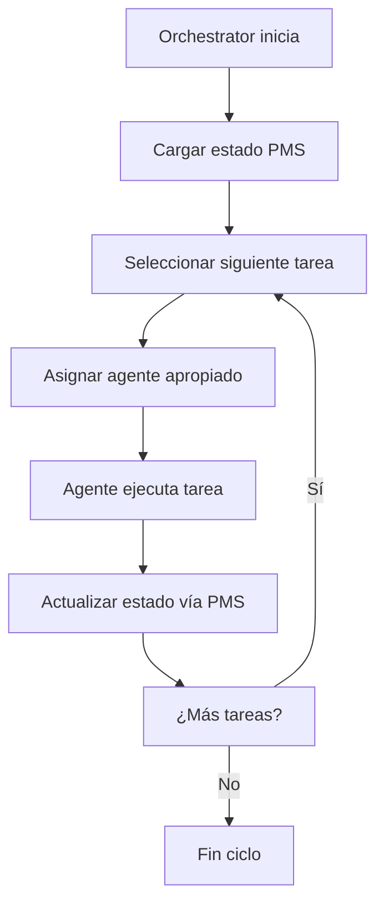
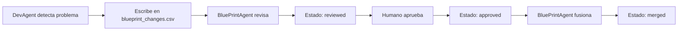

# Dev Agents System - Especificación Técnica

## DevAgents System - DevHub

Este documento define el **DevAgents System**, su **orquestación** y **contratos de integración** con PMS-Core, manteniendo separada la responsabilidad de persistencia (PMS-Core) de la lógica de coordinación (Orchestration Layer).

### Índice
1. [Arquitectura del Sistema](#1-arquitectura-del-sistema)
2. [Definición de Agent Services](#2-definición-de-agent-services)
3. [Contratos de Integración](#3-contratos-de-integración)
4. [Flow de Trabajo](#4-flow-de-trabajo)
5. [Configuración por Agente](#5-configuración-por-agente)
6. [Ejemplos de Implementación](#6-ejemplos-de-implementación)
7. [Eventos y Comunicación](#7-eventos-y-comunicación)
8. [Templates y Referencias](#8-templates-y-referencias)

---

## 1. Arquitectura del Sistema

### 1.1 Separación de Responsabilidades

```
┌──────────────────────────────┐
│  1. Orchestration Layer      │  ← CrewAI, LangGraph, custom
│     - Define flow y orden    │
│     - Maneja dependencias    │
└─────────────▲────────────────┘
              │ Comandos/Eventos
┌─────────────┴────────────────┐
│  2. Agent Services           │  ← BluePrintAgent, DevAgent...
│     - Lógica de dominio      │
│     - Usa PMS-Core API       │
└─────────────▲────────────────┘
              │ pms_core.load/save()
┌─────────────┴────────────────┐
│  3. PMS-Core Library         │  ← Definido en ../pms/pms.md
└──────────────────────────────┘
```

### 1.2 **Principio Fundamental**
> **Los agents NUNCA acceden a archivos directamente. Siempre usan la API PMS-Core.**

---

## 2. Definición de Agent Services

### 2.1 BluePrintAgent
**Responsabilidad**: Gestión exclusiva del blueprint estratégico

```yaml
agent_id: blueprint_agent
role: Strategic Blueprint Manager
scope: ["blueprint", "blueprint_changes"] 
capabilities:
  - Único agente autorizado para modificar docs/blueprint.md
  - Procesa propuestas en blueprint_changes.csv
  - Gestiona versionado SHA-1 y changelog
  - Valida formato de fases → épicas → user stories

integration:
  load_scopes: ["blueprint", "blueprint_changes", "project_charter", "roadmap"]
  save_scopes: ["blueprint", "project_status"]
  mode: "update_dual"  # Cambios críticos requieren rollback atómico
```

### 2.2 DevAgent  
**Responsabilidad**: Ejecución de tareas de desarrollo

```yaml
agent_id: dev_agent
role: Development Task Executor
scope: ["backlog_f*", "project_status"]
capabilities:
  - Lee tareas del backlog activo
  - Ejecuta tareas de código, tests, builds
  - Actualiza estado de tareas (P → C/F)
  - Propone cambios al blueprint si encuentra impedimentos técnicos

integration:
  load_scopes: ["backlog_f*", "blueprint", "project_status"]
  save_scopes: ["backlog_f*", "project_status", "blueprint_changes"]
  mode: "update_single"  # Actualizaciones de estado no críticas
```

### 2.3 QAAgent
**Responsabilidad**: Validación y testing

```yaml
agent_id: qa_agent  
role: Quality Assurance
scope: ["backlog_f*", "project_status"]
capabilities:
  - Valida criterios de aceptación
  - Ejecuta tests automáticos
  - Propone mejoras de calidad al blueprint
  - Actualiza métricas de calidad

integration:
  load_scopes: ["backlog_f*", "blueprint"]
  save_scopes: ["backlog_f*", "project_status", "blueprint_changes"]
  mode: "update_single"
```

---

## 3. Contratos de Integración

### 3.1 Regla Fundamental
**Los agentes NUNCA acceden a archivos directamente.** Siempre usan la API PMS-Core.

### 3.2 API PMS-Core para Agents

**IMPORTANTE**: Los agentes deben usar DAS Enforcer, no PMS-Core directamente.

```python
# ❌ INCORRECTO - Acceso directo (puede violar restricciones)
data = pms_core.load(scope="blueprint")
pms_core.save(scope="blueprint", payload=data, mode="update_dual")

# ✅ CORRECTO - Via DAS Enforcer (con validación de permisos)
from das.enforcer import safe_pms_call

# Cargar datos con validación
data = safe_pms_call(agent_id="dev_agent", operation="load", scope="backlog_f2")
blueprint = safe_pms_call(agent_id="dev_agent", operation="load", scope="blueprint")

# Guardar con validación de permisos
safe_pms_call(
    agent_id="dev_agent", 
    operation="save", 
    scope="backlog_f2", 
    payload=updated_backlog
)

# Exception automática si violación
try:
    safe_pms_call(agent_id="dev_agent", operation="save", scope="blueprint", payload=data)
except PermissionError as e:
    print(f"Restricción violada: {e}")
    # DevAgent no puede editar blueprint - usar blueprint_changes.csv
```

### 3.3 Tipos de Operación
- **read_only**: Solo lectura, sin modificaciones
- **update_single**: Escribe un archivo con validaciones básicas  
- **update_dual**: Rollback dual atómico para cambios críticos

### 3.4 Enforcement de Permisos

**Problema**: Las restricciones documentales pueden ser ignoradas por agentes.

**Solución**: DAS Enforcer - capa de validación técnica entre agentes y PMS-Core.

```python
# DAS Enforcer API
from das.enforcer import validate_agent_permissions

def safe_pms_call(agent_id, operation, scope, payload=None):
    """Wrapper seguro para todas las llamadas PMS-Core"""
    
    # 1. Validar permisos del agente
    validate_agent_permissions(agent_id, operation, scope)
    
    # 2. Si válido, ejecutar operación PMS-Core
    if operation == "load":
        return pms_core.load(scope=scope)
    elif operation == "save":
        return pms_core.save(scope=scope, payload=payload, mode="update_single")
    
    # 3. Si inválido, lanzar exception
    raise PermissionError(f"Agent {agent_id} no autorizado para {operation} en {scope}")
```

**Características**:
- Parsea permissions desde agent YAML
- Validación pre-ejecución obligatoria  
- Exceptions técnicas por violaciones
- PMS-Core permanece puro y agnóstico

---

## 4. Flow de Trabajo

### 4.1 Ciclo Principal



### 4.2 Gestión de Propuestas



### 4.3 Ejemplo de Implementación de Agent

```python
class DevAgent:
    def __init__(self, pms_core):
        self.pms = pms_core
    
    def execute_task(self, task_id):
        # 1. Cargar contexto
        backlog = self.pms.load(scope="backlog_f2")
        blueprint = self.pms.load(scope="blueprint") 
        
        # 2. Encontrar tarea
        task = find_task(backlog, task_id)
        
        # 3. Ejecutar trabajo
        result = self.do_development_work(task)
        
        # 4. Actualizar estado
        task.status = "C" if result.success else "F"
        self.pms.save(scope="backlog_f2", payload=backlog, mode="update_single")
        
        # 5. Actualizar métricas
        self.pms.save(scope="project_status", payload=new_metrics, mode="update_single")
        
        # 6. Si hay problemas, proponer cambio
        if result.needs_blueprint_change:
            change = {
                "id": generate_id(),
                "author": "DevAgent", 
                "timestamp": now(),
                "description": result.change_description,
                "status": "proposed"
            }
            self.pms.append(scope="blueprint_changes", payload=change)
```

---

## 5. Configuración por Agente

Cada agente tiene su configuración específica en `agents/{AgentName}.yaml`. Ver [sección 8](#8-templates-y-referencias) para templates completos.

### 5.1 Estructura de Configuración

```yaml
agent_id: [nombre_agente]
model: claude-3-5-sonnet
temperature: 0.1
system_prompt: |
  [Prompt específico del agente]
capabilities:
  - [lista de capacidades]
pms_scopes:
  read: ["scope1", "scope2"]
  write: ["scope3", "scope4"]
  mode: "update_single|update_dual"
enforcement:
  enabled: true  # Activar DAS Enforcer
  strict_mode: true  # Fallar si violación vs warning
  log_violations: true  # Log intentos de violación
```

**Scopes de Permisos**:
- `read`: Lista de scopes que el agente puede leer
- `write`: Lista de scopes que el agente puede escribir  
- `mode`: Modo PMS-Core por defecto (`update_single` o `update_dual`)
- Wildcards soportados: `"backlog_f*"` permite `backlog_f1`, `backlog_f2`, etc.

**Enforcement**:
- `enabled`: Si usar DAS Enforcer (recomendado: `true`)
- `strict_mode`: Si lanzar exceptions o solo warnings
- `log_violations`: Registrar intentos de violación para auditoría

---

## 6. Ejemplos de Implementación

### 6.1 Ejemplo con CrewAI

```yaml
# crew_config.yaml
crew:
  agents:
    - blueprint_agent
    - dev_agent  
    - qa_agent
  
  flow:
    - stage: "planning"
      agent: blueprint_agent
      trigger: "on_start"
      
    - stage: "development"
      agent: dev_agent
      trigger: "after_planning"
      depends_on: ["blueprint_ready"]
      
    - stage: "testing"
      agent: qa_agent
      trigger: "after_development"
      depends_on: ["dev_complete"]

  pms_integration:
    load_on_start: ["blueprint", "project_status"]
    save_on_complete: ["project_status"]
    health_check_interval: "5_minutes"
```

### 6.2 Ejemplo con LangGraph

```python
from langgraph import StateGraph

def create_agent_flow():
    workflow = StateGraph()
    
    # Nodos
    workflow.add_node("load_state", lambda: pms_core.load("project_status"))
    workflow.add_node("blueprint_work", blueprint_agent.execute)
    workflow.add_node("dev_work", dev_agent.execute) 
    workflow.add_node("qa_work", qa_agent.execute)
    workflow.add_node("save_state", lambda state: pms_core.save("project_status", state))
    
    # Flujo
    workflow.add_edge("load_state", "blueprint_work")
    workflow.add_edge("blueprint_work", "dev_work")
    workflow.add_edge("dev_work", "qa_work") 
    workflow.add_edge("qa_work", "save_state")
    
    return workflow.compile()
```

### 6.3 DAS Enforcer Implementation

**Archivo**: `das/enforcer.py`

```python
import yaml
from pathlib import Path
from typing import Dict, List, Literal

class DASEnforcer:
    """Sistema de enforcement de permisos para agentes DAS"""
    
    def __init__(self, agents_dir: str = "das/agents"):
        self.agents_dir = Path(agents_dir)
        self.permissions_cache = {}
    
    def load_agent_permissions(self, agent_id: str) -> Dict:
        """Carga permisos desde agent YAML"""
        if agent_id not in self.permissions_cache:
            agent_file = self.agents_dir / f"{agent_id}.yaml"
            
            if not agent_file.exists():
                raise ValueError(f"Agent {agent_id} no encontrado")
            
            with open(agent_file) as f:
                config = yaml.safe_load(f)
            
            # Extraer scopes de permisos o usar defaults
            perms = config.get('pms_scopes', {})
            self.permissions_cache[agent_id] = {
                'read_scopes': perms.get('read', []),
                'write_scopes': perms.get('write', []),
                'mode': perms.get('mode', 'update_single')
            }
        
        return self.permissions_cache[agent_id]
    
    def validate_agent_permissions(
        self, 
        agent_id: str, 
        operation: Literal['load', 'save'], 
        scope: str
    ) -> bool:
        """Valida si agente puede realizar operación en scope"""
        
        permissions = self.load_agent_permissions(agent_id)
        
        if operation == "load":
            allowed_scopes = permissions['read_scopes'] + permissions['write_scopes']
        elif operation == "save":
            allowed_scopes = permissions['write_scopes']
        else:
            raise ValueError(f"Operación inválida: {operation}")
        
        # Validar scope específico o wildcards
        for allowed in allowed_scopes:
            if scope == allowed or (allowed.endswith('*') and scope.startswith(allowed[:-1])):
                return True
        
        return False

# Global enforcer instance
_enforcer = DASEnforcer()

def safe_pms_call(agent_id: str, operation: str, scope: str, payload=None, mode=None):
    """API principal para agentes - todas las llamadas PMS-Core deben usar esto"""
    
    # 1. Validar permisos
    if not _enforcer.validate_agent_permissions(agent_id, operation, scope):
        raise PermissionError(
            f"Agent '{agent_id}' no tiene permisos '{operation}' en scope '{scope}'"
        )
    
    # 2. Ejecutar operación PMS-Core
    import pms_core
    
    if operation == "load":
        return pms_core.load(scope=scope)
    
    elif operation == "save":
        permissions = _enforcer.load_agent_permissions(agent_id)
        save_mode = mode or permissions['mode']
        return pms_core.save(scope=scope, payload=payload, mode=save_mode)
    
    else:
        raise ValueError(f"Operación no soportada: {operation}")

# Convenience functions para agentes
def agent_load(agent_id: str, scope: str):
    """Wrapper simple para carga con permisos"""
    return safe_pms_call(agent_id, "load", scope)

def agent_save(agent_id: str, scope: str, payload, mode=None):
    """Wrapper simple para guardado con permisos"""
    return safe_pms_call(agent_id, "save", scope, payload, mode)
```

**Uso en agentes**:

```python
# En DevAgent
from das.enforcer import agent_load, agent_save

class DevAgent:
    def __init__(self):
        self.agent_id = "dev_agent"
    
    def execute_task(self, task_id):
        # ✅ Automáticamente validado
        backlog = agent_load(self.agent_id, "backlog_f2")
        blueprint = agent_load(self.agent_id, "blueprint")  # OK: read permission
        
        # Procesar tarea...
        task = find_task(backlog, task_id)
        result = self.implement_task(task)
        
        # ✅ Update permitido
        agent_save(self.agent_id, "backlog_f2", updated_backlog)
        
        # ❌ Exception automática - DevAgent no puede escribir blueprint
        try:
            agent_save(self.agent_id, "blueprint", modified_blueprint)
        except PermissionError:
            # Usar workflow correcto: blueprint_changes.csv
            self.propose_blueprint_change(result.change_description)
```

---

## 7. Eventos y Comunicación

### 7.1 Eventos del Sistema

- `task_started`: Agente inicia una tarea
- `task_completed`: Tarea terminada (C/F)
- `blueprint_change_proposed`: Nueva propuesta en CSV
- `metrics_updated`: Métricas recalculadas
- `health_alert`: Sistema detecta problema (>20% bloqueadas)

### 7.2 Comunicación Entre Agentes

```python
# ❌ INCORRECTO - Acceso directo a archivos
with open("docs/blueprint.md") as f:
    blueprint = f.read()

# ✅ CORRECTO - Via PMS-Core
blueprint = pms_core.load(scope="blueprint")

# ✅ CORRECTO - Comunicación via eventos
event_bus.publish("task_completed", {"task_id": "T-1.2.1", "status": "C"})
```

---

## 8. Templates y Referencias

### 8.1 Template de Configuración de Agent

Cada agente tiene su configuración específica en `agents/{AgentName}.yaml`:

### 8.2 BluePrintAgent.yaml
```yaml
agent_id: blueprint_agent
model: claude-3-5-sonnet
temperature: 0.1
system_prompt: |
  Eres el BluePrintAgent, único responsable de gestionar docs/blueprint.md.
  
  IMPORTANTE: Solo usas la API pms_core para acceder a archivos:
  - pms_core.load(scope="blueprint")
  - pms_core.save(scope="blueprint", payload=data, mode="update_dual")
  
  Tu workflow:
  1. Procesar propuestas en blueprint_changes.csv
  2. Validar formato técnico (Fase N → Épica N.X → US-N.X.Y)  
  3. Actualizar SHA-1 y changelog
  4. Mantener integridad del blueprint estratégico

capabilities:
  - blueprint_management
  - sha1_validation
  - changelog_generation
  - proposal_processing

pms_scopes:
  read: ["blueprint", "blueprint_changes", "project_charter", "roadmap"]
  write: ["blueprint", "project_status"]
  mode: "update_dual"
```

### 8.3 Referencias Cruzadas

- **[overview.md](./overview.md)** - Resumen ejecutivo del sistema de agentes
- **[pms.md](../pms/pms.md)** - API PMS-Core, persistencia y rollback
- **Configuración específica:** `BluePrintAgent.yaml`, `DevAgent.yaml`, `QAAgent.yaml`

---

**Estado**: ✅ Especificación técnica completa • Sistema operativo • Ready for production

**Nota**: Este documento se centra exclusivamente en orquestación y flow de agentes. Para detalles de persistencia, rollback y estructura de archivos, consultar [`../pms/pms.md`](../pms/pms.md).