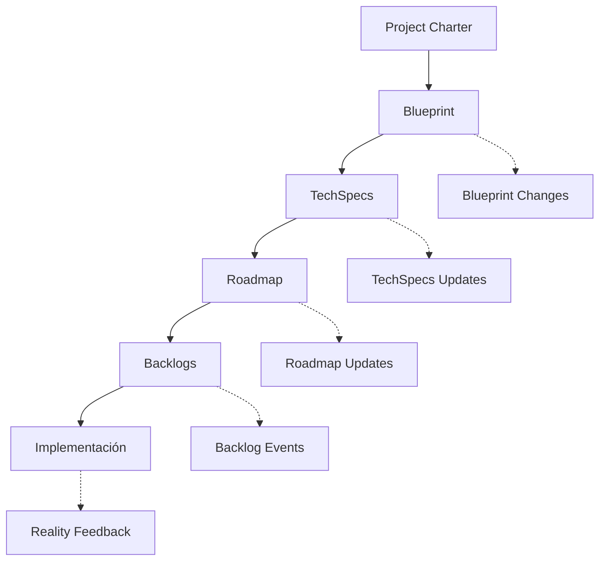

# Sistema de Governanza Documental

## Overview

DevHub implementa un **sistema de governanza documental** basado en eventos para mantener consistencia entre todos los artefactos del proyecto y coordinar cambios de manera automática.

## Flujo Principal de Documentos Actualizado



### Jerarquía de Autoridad Actualizada
1. **Project Charter** → Definición estratégica (qué y por qué)
2. **Blueprint** → Arquitectura y componentes (cómo)  
3. **TechSpecs** → Implementación detallada (técnico) - **AUTOMATIZADO**
4. **Roadmap** → Planificación temporal (cuándo)
5. **Backlogs** → Tareas específicas (ejecución)
6. **Implementación** → Código ejecutable

## Bus de Eventos Documentales

### Eventos Principales

#### BlueprintChangeEvent
```yaml
event_type: "BlueprintChangeEvent"
source: "02_blueprint.yaml"
timestamp: "2025-08-10T14:15:00Z"
author: "BluePrintAgent"
changes:
  sections_modified: ["governanza_documental"]
  impact_scope: ["techspecs", "roadmap", "backlogs"]
  propagation_required: true
correlation_id: "blueprint-change-001"
```

#### TechSpecsUpdateEvent (NUEVO)
```yaml
event_type: "TechSpecsUpdateEvent"
source: "03_TechSpecs/"
timestamp: "2025-08-10T14:18:00Z"
author: "DevAgent"
trigger: "blueprint_to_techspecs_automation"
changes:
  specs_generated: ["authentication_module.md", "logging_framework.md"]
  impact_scope: ["roadmap", "backlogs"]
  automated: true
correlation_id: "techspecs-gen-001"
```

#### RoadmapChangeEvent  
```yaml
event_type: "RoadmapChangeEvent"
source: "04_roadmap.md"  
timestamp: "2025-08-10T14:20:00Z"
author: "AiProjectManager"
changes:
  phases_affected: ["F0", "F1"]
  timeline_impact: "minor"
  backlog_sync_required: true
correlation_id: "roadmap-update-002"  
```

#### RealityFeedbackEvent
```yaml
event_type: "RealityFeedbackEvent"
source: "backlog_f1.yaml"
timestamp: "2025-08-10T14:25:00Z"
author: "DevAgent"
feedback_type: "implementation_constraint"
description: "TechSpec requiere modificación arquitectura por limitación técnica"
escalation_level: "blueprint_change_required"
correlation_id: "feedback-escalation-003"
```

### Propagación Automática

#### Top-Down (Cascada)
- **Charter → Blueprint**: Cambios estratégicos automáticamente reflejados
- **Blueprint → Roadmap**: Nuevos componentes generan items roadmap  
- **Blueprint → TechSpecs**: DevAgent genera especificaciones automáticas
- **Roadmap → Backlogs**: Fases se traducen a tareas ejecutables

#### Bottom-Up (Retroalimentación)
- **Implementación → TechSpecs**: Ajustes por realidad técnica
- **TechSpecs → Blueprint**: Cambios arquitectónicos necesarios  
- **Backlogs → Roadmap**: Ajustes temporal por blockers/delays
- **Roadmap → Blueprint**: Re-evaluación scope por timeline

## Sistema de Versionado

### Tracking de Cambios
```yaml
document_versions:
  blueprint.yaml:
    version: "2.2"
    sha1_hash: "082461c24f473da069a32b994fdf8513bdf3822e"
    last_modified: "2025-08-10T14:15:00Z"
    change_events: ["blueprint-change-001", "blueprint-change-002"]
    
  roadmap.md:
    version: "1.1"  
    sha1_hash: "a4f7d2e9c1b8f6a3d5e7c9f2a8b4d6e1c3f5a7b9"
    last_modified: "2025-08-10T14:20:00Z"
    dependencies: ["blueprint.yaml:2.2"]
```

### Agentes Especializados y Flujos Automáticos

#### DevAgent - Blueprint → TechSpecs (AUTOMATIZADO)
```yaml
trigger: "BlueprintChangeEvent"
process:
  - identify_missing_techspecs(blueprint, existing_techspecs)
  - generate_techspecs_from_blueprint(missing_components)
  - save_to_scope("techspecs", generated_content)
  - publish_event("TechSpecsUpdateEvent")
enforcement: "Scope 'techspecs' write permission via DAS"
```

#### BluePrintAgent - Único Editor Blueprint
```yaml
responsibilities:
  - "Procesar blueprint_changes.csv"
  - "Editar estructura modular docs/02_blueprint/"
  - "Regenerar 02_blueprint.yaml desde estructura modular"
  - "Gestionar versionado SHA-1"
enforcement: "Único agente con write access a blueprint scope"
```

#### AiProjectManager - Coordinación General
```yaml
responsibilities:
  - "Generar roadmap desde blueprint + techspecs"
  - "Coordinar flujos cross-document"
  - "Detectar conflicts que requieren escalación"
scope: "Read-only blueprint y backlogs, write roadmap"
```

### Consistency Validation Actualizada
```python
# Validación automática con TechSpecs
def validate_document_consistency():
    blueprint_version = get_document_version("02_blueprint.yaml")
    techspecs_version = get_latest_techspecs_version()
    roadmap_version = get_document_version("04_roadmap.md")
    
    # Validar Blueprint → TechSpecs sync
    if blueprint_version > techspecs_version.source_blueprint:
        trigger_event("TechSpecsGenerationRequired", {
            "blueprint_changes": get_changes_since(techspecs_version.source_blueprint),
            "automation_priority": "high"
        })
    
    # Validar TechSpecs → Roadmap sync  
    if techspecs_version > roadmap_version.dependency_baseline:
        trigger_event("RoadmapSyncRequired", {
            "techspecs_changes": get_changes_since(roadmap_version.dependency_baseline),
            "sync_priority": "medium"
        })
```

## Enforcement Técnico

### DAS Integration Actualizada
El sistema DAS (DevAgent System) enforza la governanza con scopes específicos:

```python
# Enforcement técnico actualizado con scopes
def validate_agent_workflow(agent_id, operation, scope):
    from das.enforcer import validate_agent_permissions
    
    # Validación automática DAS
    if not validate_agent_permissions(agent_id, operation, scope):
        raise PermissionError(f"Agent {agent_id} no tiene permisos {operation} en scope {scope}")
    
    # Validaciones específicas de flujo
    if agent_id == "DevAgent" and scope == "blueprint":
        if operation == "write":
            raise PermissionError("DevAgent debe usar blueprint_changes.csv")
    
    if scope == "techspecs" and not has_blueprint_context():
        raise ValidationError("TechSpecs requieren contexto Blueprint válido")
    
    # Validar dependencias de versionado
    if operation == "write":
        validate_dependency_versions(scope)

# Scopes DAS específicos por agente
agent_scopes = {
    "DevAgent": {
        "read": ["blueprint", "project_status", "backlog_f*", "techspecs"], 
        "write": ["project_status", "backlog_f*", "blueprint_changes", "techspecs"]
    },
    "BluePrintAgent": {
        "read": ["blueprint", "blueprint_changes", "project_status"],
        "write": ["blueprint", "project_status"]
    },
    "AiProjectManager": {
        "read": ["blueprint", "backlog_f*", "project_status"],
        "write": ["roadmap", "project_status"]
    }
}
    
    # 3. Trigger eventos de propagación
    propagation_events = calculate_propagation(document, changes)
    for event in propagation_events:
        schedule_event(event)
```

### Agentes Especializados

#### BluePrintAgent
- **Autoridad exclusiva**: Modificar blueprint.yaml
- **Responsabilidades**: Procesar blueprint_changes.csv, mantener consistencia
- **Enforcement**: Solo BluePrintAgent puede hacer commits a blueprint.yaml

#### DevAgent  
- **Capacidades**: Leer blueprint, escribir TechSpecs, proponer cambios
- **Limitaciones**: No modificar blueprint directamente
- **Workflow**: blueprint_changes.csv → BluePrintAgent approval → merge

#### AiProjectManager
- **Scope**: Coordinación general, roadmap management
- **Oversight**: Monitoreo consistency cross-documents
- **Escalation**: Detectar conflicts que requieren intervención humana

## Políticas de Coordinación

### Conflictos de Cambios
```yaml
conflict_resolution:
  priority_order:
    1: "charter_alignment"      # Cambios deben alinearse con Charter
    2: "architectural_integrity" # Consistencia arquitectónica
    3: "timeline_feasibility"   # Realismo temporal
    4: "resource_availability"  # Capacidad del equipo
    
  escalation_triggers:
    - architectural_change_required
    - timeline_impact_major  
    - resource_constraint_critical
    - charter_misalignment
```

### Aprobaciones Requeridas
- **Cambios arquitectónicos**: BluePrintAgent + Architect approval
- **Cambios timeline**: AiProjectManager + Project Manager approval  
- **Cambios scope Charter**: Manual intervention required
- **TechSpecs**: DevAgent autonomy dentro architectural boundaries

## Monitoring y Alertas

### KPIs de Governanza
```yaml
governance_metrics:
  document_consistency_score: 0.95    # >0.90 target
  propagation_delay_avg: "2.3min"     # <5min target  
  manual_interventions_rate: 0.12     # <0.20 target
  automated_sync_success: 0.87        # >0.85 target
```

### Alertas Automáticas
- **Inconsistencia detectada** → Slack notification
- **Propagation delayed >10min** → Email escalation
- **Manual approval required** → Dashboard alert
- **Document divergence >24h** → Project Manager notification

## Estado Actual y Próximos Pasos

### Implementación Actual ✅
- **Flujo Top-Down**: Charter → Blueprint → TechSpecs → Roadmap → Backlogs → Implementación
- **Automatización**: DevAgent genera TechSpecs desde Blueprint automáticamente
- **Enforcement DAS**: Scopes técnicos por agente con PermissionError automático
- **Versionado SHA-1**: Trazabilidad completa de cambios
- **Bus de Eventos**: BlueprintChangeEvent, TechSpecsUpdateEvent, RoadmapChangeEvent

### Diferencias vs Versión Anterior
**Nuevo en DevHub Actual:**
- TechSpecs como step intermedio automatizado entre Blueprint y Roadmap
- Agentes especializados con responsabilidades claras (DevAgent, BluePrintAgent, AiProjectManager)
- DAS Enforcer con validación técnica en tiempo real
- Estructura modular como fuente de verdad (docs/02_blueprint/)
- CLI + Web Dashboard como interfaces principales

### Métricas de Governanza
```yaml
governance_health:
  document_consistency_score: 0.95    # Target >0.90
  propagation_delay_avg: "2.3min"     # Target <5min  
  manual_interventions_rate: 0.12     # Target <0.20
  automated_sync_success: 0.87        # Target >0.85
```

---

**Integración**: Este sistema se integra con [DAS Enforcer](../4_seguridad_enforcement/enforcement_seguridad.md) y [Contratos de Agentes](../3_flujos_datos_eventos/contratos_agentes.md) para enforcement técnico completo.

**Metodología**: Basado en [Waterfall/V-Model](../../Waterfall_V-Model.md) con documentación exhaustiva y [top-down.md](../../top-down.md) actualizado.