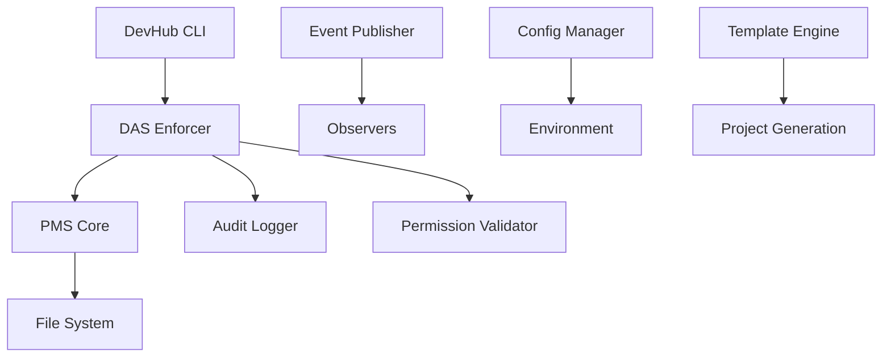

# Blueprint: {{ project.display_name }}

**Version**: 1.0.0  
**Status**: Active  
**Created**: {{ project.created_at.strftime('%Y-%m-%d') }}  
**Last Updated**: {{ project.created_at.strftime('%Y-%m-%d') }}

## System Overview

{{ project.description }}

This DevHub project implements a three-pillar architecture designed for scalable development workflows with automated agent orchestration.

## Architecture Components

### 1. PMS (Persistent Memory System)

**Purpose**: Reliable data persistence with integrity validation

**Key Features**:
- SHA-1 based integrity validation
- Atomic transactions with rollback support  
- Memory mapping and scope-based access
- YAML schema validation

**Core Classes**:
- `PMSCore`: Main persistence engine
- `IntegrityValidator`: Data integrity management
- `TransactionManager`: Atomic operation handling

### 2. DAS (DevAgent System)

**Purpose**: Agent orchestration with permission enforcement

**Key Features**:
- Granular permission system with wildcards
- Agent lifecycle management
- Comprehensive audit logging
- Filesystem protection

**Core Classes**:
- `DASEnforcer`: Main orchestration engine
- `PermissionValidator`: Access control management
- `AuditLogger`: Security and access logging
- `FilesystemProtector`: File system security

### 3. Core Components

**Purpose**: Foundational services and utilities

**Key Features**:
- Event-driven architecture with async processing
- Multi-environment configuration management
- Jinja2-based template system
- CLI interface with Click framework

**Core Classes**:
- `EventPublisher`: Event system coordination
- `ConfigManager`: Configuration management
- `TemplateEngine`: Project generation system

## Agent Ecosystem

### DevAgent
**Role**: Development task execution  
**Permissions**: 
- Read: `memory_index`, `backlog_f*`, `blueprint`, `project_status`, `techspecs`
- Write: `backlog_f*`, `project_status`, `blueprint_changes`, `techspecs`

### BluePrintAgent
**Role**: Architecture documentation management  
**Permissions**:
- Read: `memory_index`, `blueprint`, `blueprint_changes`
- Write: `blueprint`

### QAAgent
**Role**: Quality assurance and testing  
**Permissions**:
- Read: `memory_index`, `backlog_f*`, `techspecs`, `project_status`
- Write: `test_results`, `quality_reports`

### AiProjectManager
**Role**: Project coordination and oversight  
**Permissions**:
- Read: `memory_index`, `backlog_f*`, `blueprint`, `project_status`
- Write: `project_status`, `roadmap_updates`

## Data Flow Architecture



## Security Model

### Permission Enforcement
- **Scope-based access control**: Each agent has specific read/write scopes
- **Wildcard support**: `backlog_f*` allows access to all backlog phases
- **Audit logging**: All access attempts logged with stack traces
- **Filesystem protection**: Prevents unauthorized file system access

### Data Integrity
- **SHA-1 validation**: All stored data validated for integrity
- **Atomic transactions**: Ensures consistency during updates
- **Rollback capability**: Automatic rollback on operation failure

## Performance Specifications

### Event System
- **Throughput**: 328.5+ events/second
- **Concurrency**: 100+ concurrent events
- **Latency**: < 10ms average event processing

### Persistence System
- **Read Performance**: < 50ms for standard document retrieval
- **Write Performance**: < 100ms for atomic updates
- **Validation**: < 25ms for schema validation

## Configuration Management

### Environment Support
- **Development**: Default environment with debugging enabled
- **Production**: Optimized for performance and stability
- **Testing**: Isolated environment for automated testing
- **Staging**: Pre-production validation environment

### Configuration Structure
```yaml
environment: {{ config.environment or 'development' }}
database:
  connection_pool_size: 10
  timeout_seconds: 30
security:
  audit_enabled: true
  permission_strict_mode: true
```

## Development Workflow

### Task Execution Cycle
1. **DevAgent** loads current backlog phase
2. **DevAgent** identifies next available P1 task
3. **DevAgent** implements solution following TechSpecs
4. **DevAgent** updates task status and project metrics
5. **QAAgent** validates implementation (if applicable)
6. **BluePrintAgent** updates architecture docs (if needed)

### Quality Gates
- All P0 tasks must be completed before phase transition
- Test coverage must be > 85% for core components
- All audit logs must show clean permission compliance
- Documentation must be updated for architectural changes

## Integration Points

### CLI Integration
```bash
# Project creation
python devhub_cli.py create-project MyProject --template default

# Validation
python devhub_cli.py validate-structure --project-path .

# Document synchronization
python devhub_cli.py sync-documents

# Blueprint evaluation
python devhub_cli.py evaluate-blueprint --format json
```

### API Integration
```python
# Agent operations
from das.enforcer import agent_load, agent_save

# Load data with enforcement
backlog = agent_load("DevAgent", "backlog_f1")

# Save with validation
agent_save("DevAgent", "project_status", updated_status)
```

## Monitoring and Observability

### Event Tracking
- System events published for all major operations
- Observer pattern enables real-time monitoring
- Event correlation IDs for tracing

### Audit Trail
- All agent operations logged with timestamps
- Permission violations tracked with stack traces
- Session-based operation grouping

### Performance Metrics
- Event processing throughput
- Database operation latency
- Agent task completion rates
- System resource utilization

## Future Enhancements

### Phase 2 Roadmap
- Web dashboard with real-time metrics
- Advanced visualization components
- REST API for external integrations
- Multi-project management

### Scalability Considerations
- Horizontal scaling of event processing
- Database sharding for large projects
- Agent load balancing
- Caching layer for frequently accessed data

---

**Change Log**:
- v1.0.0 ({{ project.created_at.strftime('%Y-%m-%d') }}): Initial blueprint creation

**Approved By**: {{ project.author }}  
**Generated with**: DevHub Template System v{{ custom.devhub_version }}